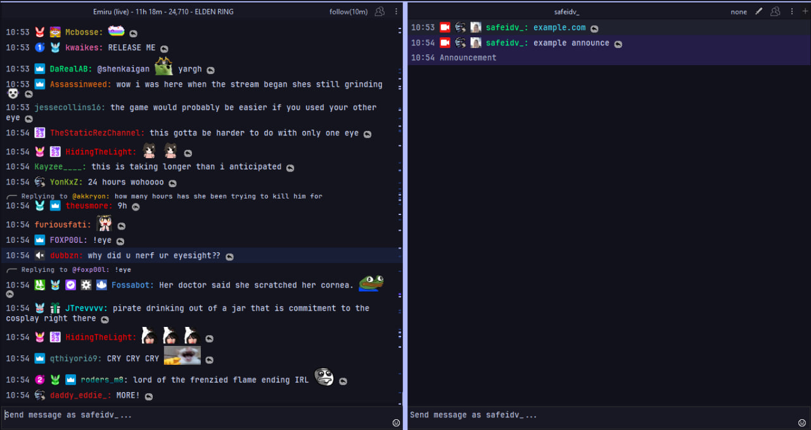

<h3 align="center">
  
   
  
  Catppuccin for <a href="https://github.com/chatterino/chatterino2">Chatterino 2</a>
  
</h3>

## Preview

## Info

Customized mocha-lavender <a href='https://github.com/catppuccin/chatterino2'>Catppuccin theme</a> for chatterino. 

## How to Use

1. Using the [wiki guide](https://wiki.chatterino.com/Settings/#where-is-my-chatterino-folder-located), navigate to your chatterino folder

2. Download and extract your chosen theme from the [latest release](https://github.com/safeidv/catppuccin-chatterino2/releases) into your configuration directory.